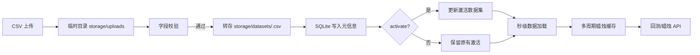

# 数据管线与接口说明

本文档总结 Mother Bar Strategy 服务的上传、存储、聚合与回测流程，供开发、测试与运维协同参考。

## 总体流程



1. 上传时使用 `POST /api/data/upload`。多部分表单字段包括：
   - `file`：必填，CSV 文件，首列需为时间戳，其余列为数值。
   - `note`：可选，字符串备注。
   - `activate`：可选布尔值，若为 `true` 或当前无激活数据集，则自动激活。
2. 校验通过后，文件转存至 `storage/datasets`，同时 `storage/data.sqlite` 的 `datasets` 表新增记录。
3. 激活数据集后，`DataService` 会以其绝对路径覆盖配置中的 `dataFile`，并加载秒级数据到内存。
4. 当回测或蜡烛接口请求特定 `timeframe` 时，会在内存中生成并缓存对应的聚合结果，重复请求命中缓存。
5. 切换激活数据集、删除数据集或源文件更新时间戳发生变化时，相关缓存会被清空以确保下一次请求重新读取。

## 存储与数据库结构

- `storage/uploads/`：上传阶段的临时目录，Bun 在启动时保证创建。处理完成后会删除临时文件。
- `storage/datasets/`：长期保存的原始 CSV，文件名即数据集 `id` 加扩展名。
- `storage/data.sqlite`：SQLite 数据库存储数据集元信息。

`datasets` 表结构：

| 列名 | 类型 | 说明 |
|------|------|------|
| `id` | TEXT PRIMARY KEY | UUID，亦作为文件名 |
| `filename` | TEXT | 存储在 `storage/datasets` 下的文件名 |
| `originalName` | TEXT | 上传时的原始文件名 |
| `uploadedAt` | TEXT | ISO8601 格式上传时间 |
| `rows` | INTEGER | 数据行数（不含表头） |
| `secondsStart` | TEXT | 首条记录的时间戳 |
| `secondsEnd` | TEXT | 末条记录的时间戳 |
| `note` | TEXT | 上传备注，可为空 |
| `isActive` | INTEGER | 是否为激活数据集（1/0） |

## 时间框架配置

- 默认值来自 `resolveConfig`：命令行 `--timeframe` > 环境变量 `TIMEFRAME` > 默认 `1m`。
- 回测接口 `POST /api/backtest` 的 `timeframe` 字段可覆盖默认值，类型需在 `SUPPORTED_TIMEFRAMES` 内。
- 蜡烛接口 `GET /api/candles` 支持 `timeframe` 查询参数，分页参数为 `page`（>=1）与 `pageSize`（1-5000）。

示例：

```bash
curl -X POST http://localhost:3000/api/backtest \
  -H "Content-Type: application/json" \
  -d '{"datasetId":"a3e8-uuid","timeframe":"5m","baseQuantity":2}'
```

若未显式传入 `timeframe`，将回退至配置值；响应中的 `metadata.timeframe` 会反映最终采用的周期。

## API 请求与响应示例

### 上传数据集

```bash
curl -X POST http://localhost:3000/api/data/upload \
  -F "file=@/path/to/data.csv" \
  -F "note=Dec RTH" \
  -F "activate=true"
```

响应：

```json
{
  "id": "a3e8...",
  "originalName": "data.csv",
  "rows": 86400,
  "secondsStart": "2023-12-01T14:30:00Z",
  "secondsEnd": "2023-12-01T21:00:00Z",
  "note": "Dec RTH",
  "isActive": true
}
```

### 列举与切换数据集

```bash
curl http://localhost:3000/api/data          # 列表
curl -X PATCH http://localhost:3000/api/data/<id>/activate
curl -X DELETE http://localhost:3000/api/data/<id>
```

### 回测与蜡烛

```bash
curl -X POST http://localhost:3000/api/backtest \
  -H "Content-Type: application/json" \
  -d '{"datasetId":"a3e8...","timeframe":"15m"}'

curl "http://localhost:3000/api/candles?page=1&pageSize=500&timeframe=15m"
```

回测响应：

```json
{
  "metadata": { "timeframe": "15m", "datasetId": "a3e8..." },
  "summary": {
    "grossProfit": 1200,
    "netProfit": 950,
    "trades": [ /* ... */ ]
  },
  "candles": [ /* CandleExportRow[] */ ],
  "trades": [ /* 与 summary.trades 相同 */ ]
}
```

## 部署与运维

- **目录权限**：确保运行账户对 `storage/` 及子目录有读写权限，可使用 `chown`/`chmod` 预先配置。
- **SQLite 备份**：建议每日执行 `sqlite3 storage/data.sqlite ".backup 'backup/data-$(date +%F).sqlite'"` 或使用卷快照。备份期间避免执行批量上传或删除。
- **缓存管理**：服务将激活数据集的全部秒级数据与访问过的蜡烛缓存在内存中。若 CSV 体积大，请监控内存；必要时拆分数据集或在维护窗口重启服务。
- **容器部署**：若运行在容器中，请将 `storage/` 映射为持久卷以保证数据集与 SQLite 文件不随容器销毁。

## 前端联调说明

- 数据集相关接口统一返回 `id`, `originalName`, `rows`, `secondsStart`, `secondsEnd`, `note`, `isActive` 字段；若前端之前依赖其它字段命名，需要同步更新模型。
- 回测响应新增 `metadata`、`candles`、`trades` 顶层字段。`summary.trades` 仍保留但不再建议作为唯一数据源。
- 当用户上传或切换激活数据集时，后端缓存会被刷新；前端应在操作成功后重新调用 `GET /api/candles` 并依据 `metadata.timeframe` 更新图表配置。
- 若在回测请求中加入新的参数（如 `baseQuantity` 等数值字段），请确保传入数值或可被转换为数值的字符串，避免 DTO 验证失败。
