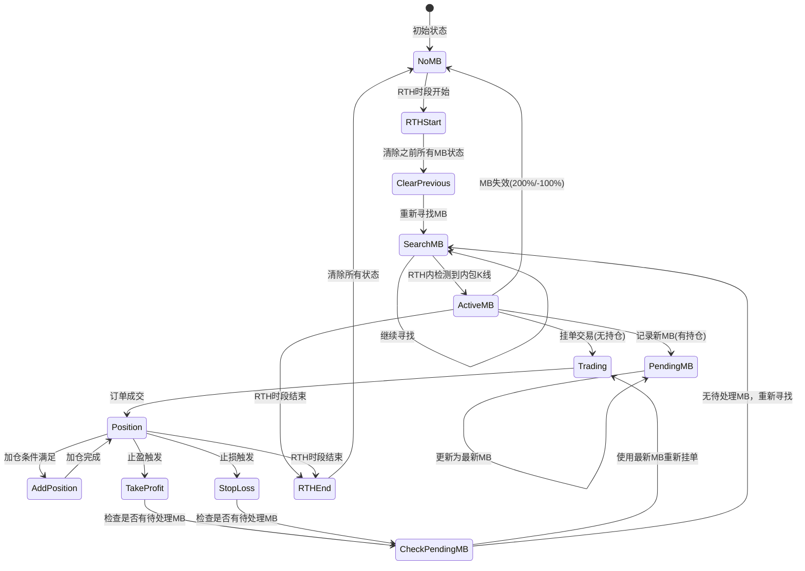
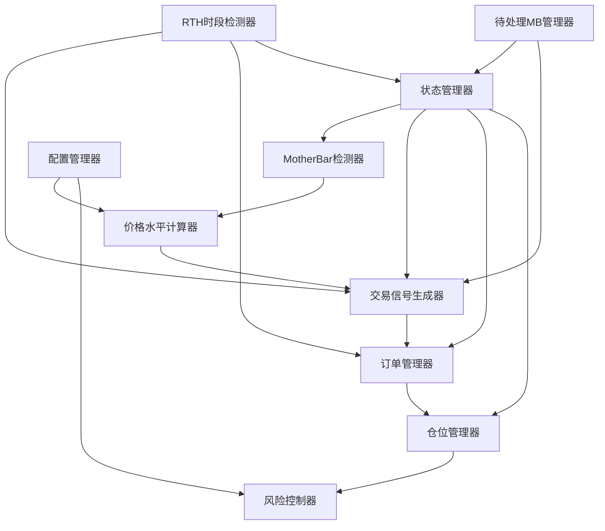
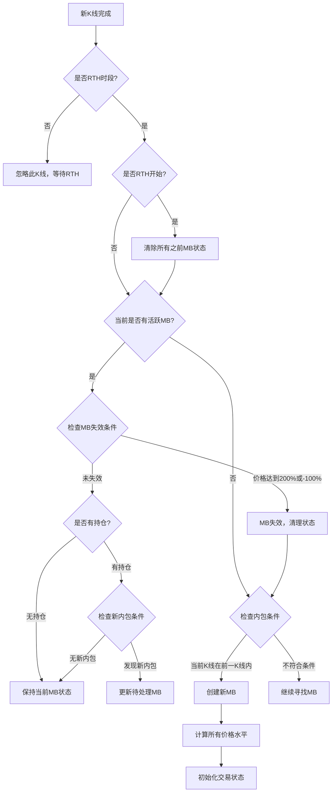
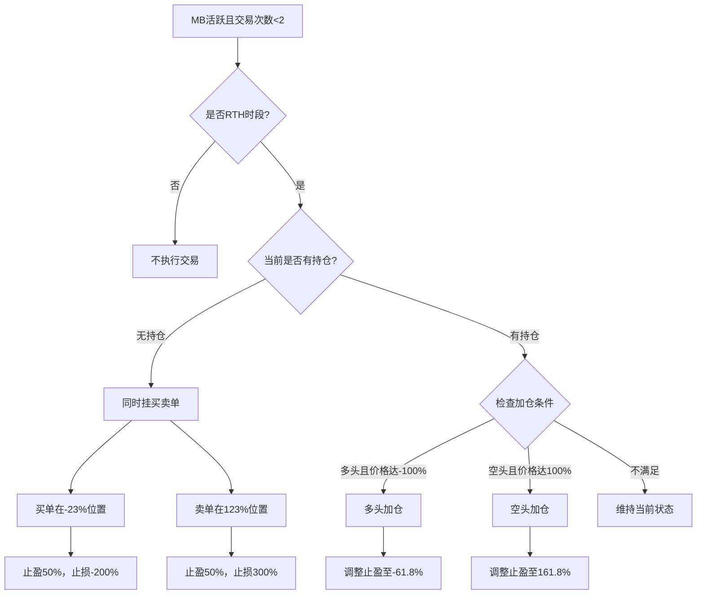
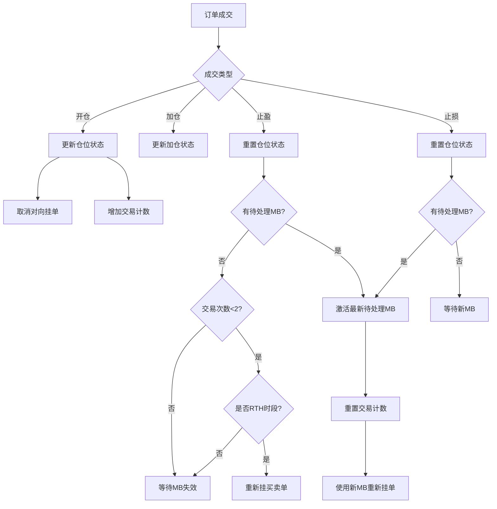

# MotherBar策略重写设计文档

## 概述

本设计文档描述了基于 mother-bar-rule.md 规则文档对现有 MB.pine 策略的完整重写。现有策略存在多个与规则文档不一致的地方，需要进行全面的架构重新设计以确保完全符合规范要求。

### 项目目标
- 完全按照 mother-bar-rule.md 规定的规则重新实现 MotherBar 策略
- 修正现有实现中的逻辑错误和规则偏差
- 建立清晰的状态管理机制
- 实现完整的交易生命周期管理
- 严格限制仅在RTH交易时段执行策略，避免跨时段跳空风险
- 每个RTH开始时重新寻找MB，忽略之前的MB状态
- 建立持仓期间的新MB记录机制，避免冲突交易

## 系统集成与数据流更新

### 上传到回测的端到端流程

1. `POST /api/data/upload` 接收前端上传的秒级 CSV。文件首先写入 `storage/uploads`，通过列头与数值校验后转存到 `storage/datasets/<uuid>.csv`。
2. 同步在 SQLite (`storage/data.sqlite`) 中写入数据集元信息：原始文件名、行数、首尾时间戳、备注以及激活状态。`activate=true` 或无激活数据集时会自动将其设为当前数据源。
3. 数据集一旦激活，`DataService.getBaseConfig()` 会以它的绝对路径覆盖策略配置中的 `dataFile` 字段，后续的蜡烛聚合与回测均使用该文件。
4. `DataService` 将秒级数据与派生的多周期蜡烛缓存在内存中；当切换激活数据集或源文件发生变动时会自动失效缓存。
5. 回测通过 `POST /api/backtest` 触发，可传入 `datasetId` 或 `dataFile`，二者二选一。请求体中的 `timeframe` 会覆盖默认周期，用于 `runBacktest` 聚合及策略执行。

### 数据存储与结构

- `storage/uploads/`：临时目录，服务在启动时确保存在，文件处理完毕后即删除。
- `storage/datasets/`：永久保存原始 CSV，文件名与 SQLite `datasets` 表的 `id` 一致。
- `storage/data.sqlite`：数据集索引库，结构如下：

  | 字段 | 类型 | 描述 |
  |------|------|------|
  | id | TEXT PRIMARY KEY | 数据集 UUID |
  | filename | TEXT | 对应 `storage/datasets` 下的文件 |
  | originalName | TEXT | 上传时的原始文件名 |
  | uploadedAt | TEXT | ISO8601 上传时间 |
  | rows | INTEGER | 数据行数（不含表头） |
  | secondsStart | TEXT | 第一条记录时间戳 |
  | secondsEnd | TEXT | 最后一条记录时间戳 |
  | note | TEXT | 上传备注 |
  | isActive | INTEGER | 是否为激活数据集 |

### API 端点与示例

- `POST /api/data/upload`：多部分表单上传 CSV，支持 `note` 与 `activate` 字段。响应中新增 `rows`、`secondsStart`、`secondsEnd` 字段。
- `GET /api/data`：返回所有数据集元信息数组，`isActive=true` 为当前使用的数据源。
- `PATCH /api/data/:id/activate`：切换激活数据集，触发后端缓存失效。
- `DELETE /api/data/:id`：删除数据集与对应文件。
- `POST /api/backtest`：请求体可包含 `datasetId`、`dataFile`、`timeframe` 以及策略开关。返回结构包含 `metadata`、`summary`、`candles`、`trades`。
- `GET /api/candles?page=1&pageSize=500&timeframe=5m`：按周期返回分页蜡烛数据，供前端图表消费。

回测请求示例：

```json
{
  "datasetId": "a3e8-uuid",
  "timeframe": "15m",
  "baseQuantity": 2,
  "enableLongEntry": true,
  "enableShortEntry": false
}
```

### 时间框架选择

- 默认周期来自配置解析顺序：CLI `--timeframe` → 环境变量 `TIMEFRAME` → 默认 `1m`。
- `POST /api/backtest` 的 `timeframe` 字段允许在单次回测中覆盖默认配置。
- `GET /api/candles` 的查询参数 `timeframe` 同样遵循 `SUPPORTED_TIMEFRAMES` 列表（如 `1m`, `5m`, `15m`, `30m`, `1h`）。

### 部署与运维注意事项

- **目录权限**：部署前创建 `storage/`, `storage/uploads/`, `storage/datasets/` 并确保运行账户拥有读写权限，避免上传失败。
- **SQLite 备份**：可通过 `sqlite3 storage/data.sqlite ".backup 'backup/data-$(date +%F).sqlite'"`、文件系统快照或容器卷备份定期保存；备份期间避免高频写操作。
- **内存缓存**：当前实现会缓存整套秒级数据及所有请求过的周期蜡烛。部署在内存受限环境时需控制单个 CSV 大小，或安排定期重启/切换数据集以释放缓存。

### 前端联调提醒

- 数据集接口新增 `rows`、`secondsStart`、`secondsEnd` 字段以及 `note`、`isActive` 的可靠返回，请确保 UI 展示与筛选逻辑同步更新。
- 回测响应同时返回 `candles` 与 `trades` 数组，`summary.trades` 仍然存在但建议改读顶层 `trades`，避免字段调整带来的兼容问题。
- 切换激活数据集或上传新数据后缓存刷新可能导致蜡烛数量变化，前端应在操作完成后重新请求 `GET /api/candles` 并根据 `metadata.timeframe` 调整展示。

## 核心问题分析

### 现有实现的主要问题

| 问题类别 | 现有实现 | 规则要求 | 影响 |
|---------|---------|---------|-----|
| MB失效条件 | 使用61.8%阈值 | 200%和-100%位置 | 错误的MB生命周期管理 |
| 交易方向限制 | 基于阳线/阴线限制 | 无限制，同时挂买卖单 | 交易机会丢失 |
| 止损设置 | -100%和200% | -200%或300% | 风险控制不当 |
| 加仓机制 | 无实现 | 完整的加仓和止盈调整 | 错失盈利优化 |
| 交易次数限制 | 无限制 | 每个MB最多2笔交易 | 过度交易风险 |
| 交易时段控制 | 无限制 | 仅RTH时段交易 | 跨时段跳空风险暴露 |
| RTH重置机制 | 无处理 | RTH开始时重新寻找MB | 跨时段状态混乱 |
| 持仓期新MB | 无处理 | 记录但不交易 | 冲突交易风险 |

## 架构设计

### 状态管理架构



### 核心组件架构



## 数据模型设计

### MotherBar状态模型

| 字段名 | 类型 | 描述 | 初始值 |
|--------|------|------|--------|
| isActive | boolean | MB是否活跃 | false |
| highPrice | float | MB高点价格 | na |
| lowPrice | float | MB低点价格 | na |
| size | float | MB大小(高-低) | na |
| startBar | int | MB开始K线索引 | na |
| creationTime | int | MB创建时间 | na |
| isRTH | boolean | 是否在RTH时段创建 | false |

### 待处理MotherBar模型

| 字段名 | 类型 | 描述 | 初始值 |
|--------|------|------|--------|
| hasPendingMB | boolean | 是否有待处理MB | false |
| pendingHighPrice | float | 待处理MB高点 | na |
| pendingLowPrice | float | 待处理MB低点 | na |
| pendingSize | float | 待处理MB大小 | na |
| pendingStartBar | int | 待处理MB开始K线 | na |
| pendingCreationTime | int | 待处理MB创建时间 | na |

### 价格水平模型

| 水平位置 | 百分比 | 计算公式 | 用途 |
|----------|--------|----------|------|
| 300% | 300 | low + size * 3 | 空头止损 |
| 200% | 200 | low + size * 2 | MB失效边界 |
| 161.8% | 161.8 | low + size * 1.618 | 空头加仓后止盈 |
| 123% | 123 | low + size * 1.23 | 限价卖出区域 |
| 100% | 100 | high | MB高点/空头加仓 |
| 50% | 50 | low + size * 0.5 | 统一止盈位置 |
| 0% | 0 | low | MB低点 |
| -23% | -23 | low - size * 0.23 | 限价买入区域 |
| -61.8% | -61.8 | low - size * 0.618 | 多头加仓后止盈 |
| -100% | -100 | low - size | MB失效边界/多头加仓 |
| -200% | -200 | low - size * 2 | 多头止损 |

### 交易状态模型

| 字段名 | 类型 | 描述 |
|--------|------|------|
| tradeCount | int | 当前MB的交易次数 |
| hasLongPosition | boolean | 是否持有多头仓位 |
| hasShortPosition | boolean | 是否持有空头仓位 |
| longEntryPrice | float | 多头入场价格 |
| shortEntryPrice | float | 空头入场价格 |
| isAddedLong | boolean | 多头是否已加仓 |
| isAddedShort | boolean | 空头是否已加仓 |
| hasAnyPosition | boolean | 是否持有任何仓位 |

### RTH时段状态模型

| 字段名 | 类型 | 描述 |
|--------|------|------|
| isRTHActive | boolean | 当前是否为RTH时段 |
| isFirstRTHBar | boolean | 是否为RTH首根K线 |
| isLastRTHBar | boolean | 是否为RTH最后K线 |
| rthStartDetected | boolean | 是否检测到RTH开始 |
| prevRTHClose | float | 前一RTH时段收盘价 |
| rthSessionCount | int | RTH会话计数器 |

## 业务逻辑设计

### MotherBar检测逻辑



### 交易执行逻辑



### 仓位管理逻辑



## 关键算法设计

### 内包K线检测算法

**输入条件：**
- 当前K线的高低价
- 前一K线的高低价
- RTH时段状态
- 当前持仓状态

**检测规则：**
- 当前K线高价 ≤ 前一K线高价
- 当前K线低价 ≥ 前一K线低价
- 两个条件同时满足时形成内包关系

**处理逻辑：**
- RTH时段内 + 无持仓：创建活跃MB
- RTH时段内 + 有持仓：创建待处理MB
- 非RTH时段：仅记录但不创建MB

### 内包K线检测算法

**输入条件：**
- 当前K线的高低价
- 前一K线的高低价
- RTH时段状态
- 当前持仓状态

**检测规则：**
- 当前K线高价 ≤ 前一K线高价
- 当前K线低价 ≥ 前一K线低价
- 两个条件同时满足时形成内包关系
- 仅在RTH时段内处理内包检测

**处理逻辑：**
- RTH时段内 + 无持仓：创建活跃MB
- RTH时段内 + 有持仓：创建待处理MB
- 非RTH时段：忽略不处理

### RTH时段检测算法

**检测方法：**
- 使用session.isfirstbar_regular检测RTH开始
- 使用session.islastbar_regular检测RTH结束
- 维护RTH状态和会话计数

**RTH开始处理：**
- 清除所有之前的MB状态（活跃MB、待处理MB）
- 重置交易计数器
- 取消所有挂单
- 清除仓位状态标志
- 开始重新寻找新的MB

**RTH结束处理：**
- 保持现有仓位不变
- 停止新的MB检测
- 暂停所有新交易
- 保持现有止盈止损订单

**跳空风险避免：**
- 通过严格限制仅在RTH时段交易，自然避免跨时段跳空
- RTH开始时重置所有状态，消除隔夜跳空影响
- 非RTH时段完全停止策略活动

### 价格水平计算算法

**基础参数：**
- MB低点 (mbLow)
- MB高点 (mbHigh)  
- MB大小 (mbSize = mbHigh - mbLow)

**计算公式：**
- 正百分比位置：mbLow + mbSize * (percentage / 100)
- 负百分比位置：mbLow - mbSize * (abs(percentage) / 100)

**检测条件：**
- 价格突破200%水平：price ≥ mbLow + mbSize * 2
- 价格突破-100%水平：price ≤ mbLow - mbSize
- 考虑跳空影响：跳空导致的瞬间突破

**触发动作：**
- 清除当前活跃MB状态
- 取消所有挂单
- 重置交易计数器
- 保留待处理MB（如果存在）

### RTH时段检测算法

**检测方法：**
- 使用session.islastbar_regular检测RTH最后K线
- 使用session.isfirstbar_regular检测RTH第一K线
- 维护RTH状态标志

**状态管理：**
- RTH开始：重置日间状态，准备交易
- RTH结束：暂停新交易，保持现有仓位
- 非RTH时段：仅监控，不执行新交易

## 风险控制设计

### 交易次数控制

| 控制项 | 限制规则 | 实现方式 |
|--------|----------|----------|
| 每MB最大交易 | 2笔 | 交易计数器 |
| 重复挂单条件 | 止盈后允许 | 状态标志位 |
| 加仓限制 | 每方向最多1次 | 加仓标志位 |

### 仓位风险控制

| 风险类型 | 控制措施 | 实现方式 |
|----------|----------|----------|
| 单向仓位 | 同时只能持有一个方向 | 仓位状态检查 |
| 止损保护 | 固定止损水平 | 自动止损单 |
| 加仓风险 | 条件严格限制 | 价格水平验证 |

### 订单管理控制

| 管理项 | 控制规则 | 实现方式 |
|--------|----------|----------|
| 挂单取消 | 成交一方向后取消另一方向 | 自动取消逻辑 |
| 重复挂单 | 防止重复挂同类订单 | 状态检查 |
| 订单更新 | 加仓后更新止盈位置 | 动态调整机制 |

## 配置参数设计

### 交易参数配置

| 参数名 | 类型 | 默认值 | 描述 |
|--------|------|--------|------|
| enableTrading | boolean | true | 是否启用交易 |
| initialCapital | float | 50000 | 初始资金 |
| defaultQty | int | 5 | 默认交易数量 |
| enableRTHOnly | boolean | true | 仅RTH时段交易 |
| rthSessionReset | boolean | true | RTH开始时重置状态 |

### 价格水平配置

| 参数名 | 类型 | 固定值 | 描述 |
|--------|------|--------|------|
| buyZonePercent | float | -23 | 买入区域百分比 |
| sellZonePercent | float | 123 | 卖出区域百分比 |
| takeProfitPercent | float | 50 | 止盈百分比 |
| longStopLossPercent | float | -200 | 多头止损百分比 |
| shortStopLossPercent | float | 300 | 空头止损百分比 |

### 加仓配置

| 参数名 | 类型 | 固定值 | 描述 |
|--------|------|--------|------|
| longAddPercent | float | -100 | 多头加仓百分比 |
| shortAddPercent | float | 100 | 空头加仓百分比 |
| longAddTpPercent | float | -61.8 | 多头加仓后止盈 |
| shortAddTpPercent | float | 161.8 | 空头加仓后止盈 |

## 测试策略

### 单元测试覆盖

| 测试模块 | 测试场景 | 预期结果 |
|----------|----------|----------|
| MB检测 | 内包K线识别 | 正确创建MB |
| 价格计算 | 各水平位置计算 | 精确的价格水平 |
| 失效检测 | 200%/-100%突破 | 及时失效并清理 |
| 交易逻辑 | 同时挂买卖单 | 正确的订单状态 |
| 加仓机制 | 条件触发加仓 | 正确的仓位调整 |
| RTH检测 | 时段边界识别 | 正确的时段状态 |
| RTH重置 | 状态清理机制 | 完全的状态重置 |
| 持仓期MB | 新MB记录机制 | 正确的待处理状态 |

### 集成测试场景

| 测试场景 | 测试步骤 | 验证点 |
|----------|----------|-------|
| 完整交易周期 | MB创建→挂单→成交→止盈 | 状态转换正确 |
| 加仓流程 | 开仓→价格到达加仓位→加仓→止盈调整 | 加仓逻辑正确 |
| MB失效处理 | MB活跃→价格突破→状态清理 | 清理彻底 |
| 交易次数限制 | 连续交易→达到上限→停止挂单 | 限制有效 |
| RTH边界测试 | RTH结束→新MB出现→仅记录不交易 | RTH控制有效 |
| RTH重置测试 | RTH开始→清理旧状态→重新寻找MB | 状态重置正确 |
| 持仓期新MB | 持仓中→新MB→记录待处理→止盈后激活 | 待处理机制有效 |
| 跨时段测试 | RTH结束→持仓过夜→RTH开始→状态重置 | 跨时段状态管理正确 |置 | 异常情况处理 |

### 性能测试要求

| 性能指标 | 目标值 | 测试方法 |
|----------|--------|----------|
| 计算延迟 | <1ms | 单K线处理时间 |
| 内存占用 | <10MB | 状态变量内存使用 |
| 历史回测 | 支持1年+ | 长期数据测试 |
| RTH检测性能 | <0.1ms | 时段判断延迟 |
| 状态切换延迟 | <0.2ms | 状态变量更新时间 |